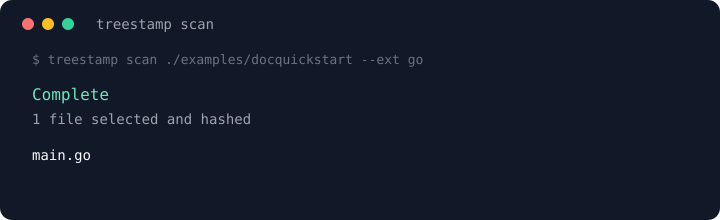
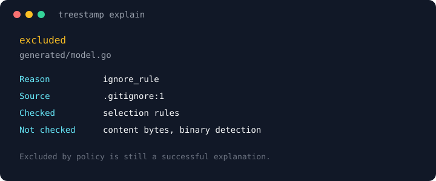

# Treestamp CLI

The CLI is a thin process on the public library. It does not import
`internal/` scanner packages and does not grow a second engine.

```text
go install github.com/sergii-ziborov/treestamp/cmd/treestamp@v0.1.4
```

Nested-module docs:
[pkg.go.dev/github.com/sergii-ziborov/treestamp/cmd/treestamp](https://pkg.go.dev/github.com/sergii-ziborov/treestamp/cmd/treestamp).

## When to use it

The library is for Go. The CLI is for CI, a shell, and a person asking
why a path missed the baseline. It is the same scanner.

| Situation | Command |
| --- | --- |
| Gate CI on selected bytes | `verify --root` |
| Save that gate in Git | `scan --output` on a subtree |
| Compare two job artifacts | `diff --exit-code` |
| Names into another tool | `paths --null` |
| Why a path was dropped | `explain` |
| Hash a release tree as shipped | `scan --profile artifact` |

Do not use it as `find`, a daemon, or a hashdeep codec. `paths` can
list a binary that `scan` later drops.

```text
treestamp scan ./examples/docquickstart --ext go
treestamp explain testdata/generated/model.go --root .
treestamp verify ./baselines/cli.tstamp.json --root ./cmd/treestamp
```





## Baseline you can commit

`--output` must sit outside the scan root. To keep a manifest in the
same Git repository, scan a subtree:

```text
treestamp scan ./cmd/treestamp --ext go --json --output ./baselines/cli.tstamp.json
treestamp verify ./baselines/cli.tstamp.json --root ./cmd/treestamp
```

A whole-tree baseline belongs beside the checkout:

```text
treestamp scan . --ext go --json --output ../repo.tstamp.json
```

Do not write `treestamp scan --json > ./baseline.tstamp.json`. The shell
creates that file first; Treestamp would then select it.

`verify` always needs `--root`. The manifest does not choose the tree.
Matching size and mtime is not enough. Fast cache is never treated as
content proof. An incomplete or `--metadata-only` baseline cannot be
verified.

## CI

Gate the job on the process exit code:

```text
treestamp verify ./baselines/cli.tstamp.json --root ./cmd/treestamp --json
```

Exit `1` is a finished difference. Exit `3` is a partial walk; do not
treat that as “clean”. Without `--json`, `verify` and `diff` print
every added, removed, changed, and renamed path. `--null` writes those
records with a NUL after each one (`--json` and `--null` cannot be
combined).

```yaml
- uses: actions/setup-go@v5
  with:
    go-version: "1.21.x"
- run: go install github.com/sergii-ziborov/treestamp/cmd/treestamp@v0.1.4
- run: treestamp verify ./baselines/cli.tstamp.json --root ./cmd/treestamp --json
```

When two jobs already produced manifests and the trees are gone:

```text
treestamp diff ./baselines/before.tstamp.json ./baselines/after.tstamp.json --json --exit-code
```

`diff` does not open the repository. `verify` does.

## Selected paths without hashing

Same ignore and filter rules as `scan`. `paths` does not apply binary
or size checks; those run when `scan` hashes.

```text
treestamp paths . --ext go --null | xargs -0 gofmt -l
```

`--json` is the PowerShell-friendly form. `--absolute` when the next
command cannot run from the scan root. `--null` and `--json` cannot be
combined. `--metadata-only` is invalid here: `paths` is already
content-free.

`scan --format ndjson` writes one JSON object per line as files are
hashed (`scan_begin`, `file_committed`, `scan_end`). It is not a second
scan engine. `--output` still writes the baseline only after a complete
walk.

Default `--profile repo` is the source profile: gitignore applies,
binaries are skipped, files over 1.5MiB are skipped. `--profile artifact`
hashes every selected file, including binaries, large files, and
generated directories such as `node_modules`. It does not read gitignore.
VCS directories still stay out. The stored name is `artifact-v2`.
`artifact-v1` snapshots keep the older generated-directory skips.
This is not a hashdeep digest list.

## Explain a skip with the same policy

```text
treestamp explain skip.txt --root . --ext go
```

An excluded path is still exit `0`. `--json` reports `outcome`,
`source`, `line`, and `pattern`. Bytes and binary detection are not
checked.

## Shared policy file

Schema `treestamp.policy/v1`. Flags override empty slices from the file.
`profile` may be `repo` or `artifact`.

```text
treestamp config --config policy.json
treestamp scan . --config policy.json --json --output ../out.tstamp.json
```

`--scope` does not cancel ignore rules. `--no-ignore` drops ignore files
and keeps standard skips. `--exclude` matches a substring of the
relative path.

## Flags that stay honest

| Flag | Meaning |
| --- | --- |
| `--scope GLOB` | Narrow the tree. Ignore rules still apply. |
| `--exclude SUBSTR` | Subtract relative paths that contain this string. |
| `--ext` | Extension filter. Dots are optional. |
| `--json` | One versioned document on stdout. |
| `--output FILE` | Atomic write. File must be outside the scan root. |
| `--null` | `paths`: exact names, NUL separated. `verify` / `diff`: raw changed paths, NUL separated. |
| `--absolute` | `paths` only. Print absolute paths. |
| `--profile` | `repo` (default) or `artifact` (`artifact-v2`). Artifact hashes binaries and ignores gitignore; VCS dirs stay skipped. |
| `--metadata-only` | `scan` only. No content hashes; `verify` will refuse. Invalid with `--profile artifact`. |
| `--color` | `auto`, `always`, or `never`. `NO_COLOR` wins. |

## What this release does not do

No `watch`, `--exec`, TUI, server, MCP, hidden cache, or plugin loader.
`cmd/treestamp-driver` stays the fixture protocol driver.

## Versions

`treestamp version --json` prints CLI, core, and manifest schema. Nested
module tags use the `cmd/treestamp/v…` Git prefix. `go install` still
takes `@v0.1.4` for the current CLI tag. The library import is
`github.com/sergii-ziborov/treestamp@v0.1.4`.
